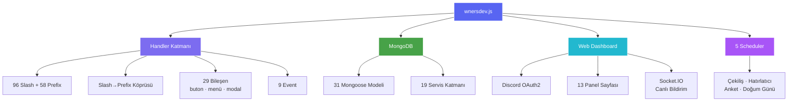
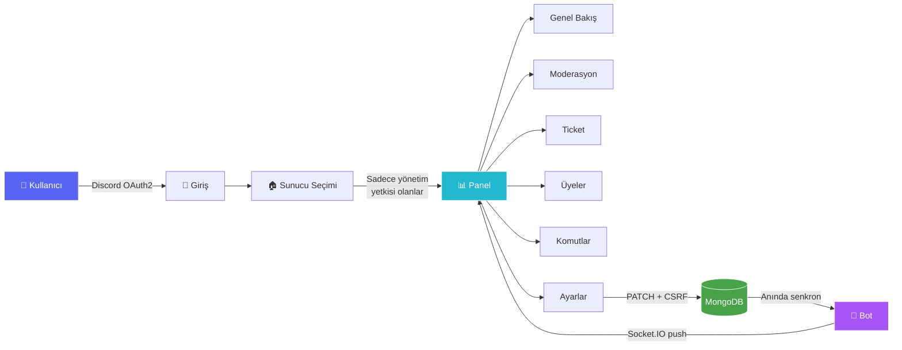

<div align="center">


<br/>


<br/>


</div>

---

<div align="center">

### 🎯 Nedir?

**wnersdev**, bir Discord sunucusunun ihtiyaç duyduğu her şeyi tek bir yerde toplayan,<br/>
baştan sona **Türkçe** yazılmış, MongoDB tabanlı, gerçek zamanlı web paneli olan bir bottur.

</div>

<br/>

<div align="center">
<table>
<tr>
<td align="center" width="25%">🛡️<br/><b>Moderasyon</b><br/><sub>20 komut · birleşik case sistemi</sub></td>
<td align="center" width="25%">🔐<br/><b>Koruma</b><br/><sub>Anti-spam · raid · nuke · link</sub></td>
<td align="center" width="25%">🎫<br/><b>Ticket</b><br/><sub>6 kategori · transkript</sub></td>
<td align="center" width="25%">🎵<br/><b>Müzik</b><br/><sub>Kuyruk · döngü · geçmiş</sub></td>
</tr>
<tr>
<td align="center">💰<br/><b>Ekonomi</b><br/><sub>Sanal para · günlük · market</sub></td>
<td align="center">⭐<br/><b>Seviye</b><br/><sub>XP · canvas kart · ödül rolü</sub></td>
<td align="center">🎉<br/><b>Çekiliş</b><br/><sub>Şartlı katılım · otomatik bitiş</sub></td>
<td align="center">🏠<br/><b>Özel Oda</b><br/><sub>Geçici ses kanalı · tam kontrol</sub></td>
</tr>
<tr>
<td align="center">🌐<br/><b>Dashboard</b><br/><sub>OAuth2 · canlı veri · 7 tema</sub></td>
<td align="center">🏅<br/><b>Başarı</b><br/><sub>Rozet sistemi · otomatik</sub></td>
<td align="center">📝<br/><b>Başvuru</b><br/><sub>Modal form · onay akışı</sub></td>
<td align="center">💾<br/><b>Yedekleme</b><br/><sub>Rol · kanal · geri yükleme</sub></td>
</tr>
</table>
</div>

---

## 📊 Proje Haritası



---

## ⚡ Hızlı Kurulum

<div align="center">

| Adım | Komut |
|:---:|:---|
| **1** | `npm install` |
| **2** | `cp ayarlar.ornek.json ayarlar.json` → doldur |
| **3** | `npm run deploy` |
| **4** | `npm start` |

</div>

<details>
<summary><b>📋 Detaylı kurulum rehberi (tıkla)</b></summary>

<br/>

### Gereksinimler
- **Node.js** 18.17 veya üzeri
- **MongoDB** veritabanı ([Atlas ücretsiz katmanı](https://www.mongodb.com/atlas) yeterli)
- Bir **Discord Bot** hesabı

### 1️⃣ Discord Developer Portal
1. [Developer Portal](https://discord.com/developers/applications) → **New Application**
2. **Bot** sekmesi → token'ı kopyala
3. **Privileged Gateway Intents** altında şunları aç:
   - ✅ `SERVER MEMBERS INTENT`
   - ✅ `MESSAGE CONTENT INTENT`
4. **OAuth2 → General** → *Client Secret*'ı kopyala (dashboard girişi için)
5. **OAuth2 → URL Generator** → `bot` + `applications.commands` scope'larını seç → botu davet et

### 2️⃣ Bağımlılıklar
```bash
npm install
```

### 3️⃣ Yapılandırma
```bash
cp ayarlar.ornek.json ayarlar.json
```

| Alan | Açıklama |
|---|---|
| `token` | Bot token'ınız |
| `clientId` | Application ID |
| `guildId` | *(Opsiyonel)* Test sunucusu — komutlar anında görünür |
| `mongodbUri` | MongoDB bağlantı adresi |
| `varsayilanPrefix` | Varsayılan prefix (örn. `!`) |
| `dashboardUrl` | Panel adresi (örn. `http://localhost:3000`) |
| `dashboardPort` | Panel portu |
| `discordClientSecret` | OAuth2 Client Secret |
| `sessionSecret` | Rastgele, uzun bir gizli anahtar |
| `developerIds` | Geliştirici ID'leri, dizi olarak `["123...", "456..."]` |
| `destekSunucusu` | Destek sunucusu davet linki |

> ⚠️ **`ayarlar.json` token içerir.** `.gitignore`'da tanımlıdır — GitHub'a **asla** yüklemeyin. Paylaşım için `ayarlar.ornek.json` şablonunu kullanın.

### 4️⃣ Komutları kaydet
```bash
npm run deploy
```
`guildId` doluysa komutlar saniyeler içinde görünür. Boşsa global kayıt yapılır (~1 saat yayılma).

### 5️⃣ Başlat
```bash
npm start
```

</details>

---

## 🎨 Web Dashboard

<div align="center">


</div>



<details>
<summary><b>🎨 Tema paleti</b></summary>

<br/>

| Tema | Renk | Tema | Renk |
|---|---|---|---|
| **Discord** | `#5865F2` 🟦 | **Emerald** | `#10b981` 🟩 |
| **Midnight** | `#7c6cf0` 🟪 | **Sunset** | `#fb7185` 🟥 |
| **Ocean** | `#22b8cf` 🟦 | **Cyber** | `#f0abfc` 🟪 |
| **Purple** | `#a855f7` 🟪 | **Özel** | Kendi rengin 🎨 |

Seçim `localStorage`'da saklanır, sayfa yenilenince korunur.

</details>

<details>
<summary><b>📄 Panel sayfaları</b></summary>

<br/>

| Sayfa | İçerik |
|---|---|
| 🏠 **Genel Bakış** | Üye/ticket/uyarı/çekiliş kartları, canlı bot durumu, abonelik planı |
| 🔨 **Moderasyon** | Uyarı tablosu, panelden uyarı verme, denetim kaydından ban/kick geçmişi |
| 🎫 **Ticket** | Açık/kilitli/kapalı sayıları, ortalama çözüm süresi, ticket tablosu |
| 👥 **Üyeler** | Canlı arama (debounce'lu), avatar, rol sayısı, katılma tarihi |
| 🎭 **Roller & Kanallar** | Renkli rol listesi, tür ikonlu kanal listesi |
| 📝 **Komutlar** | Her komutu tek tek aç/kapat, cooldown düzenle, arama + kategori filtresi |
| 📨 **Öneriler** | Bekleyen/kabul/red sayıları ve son öneriler |
| 🎉 **Çekilişler** | Aktif/bitmiş çekilişler, katılımcı sayıları |
| 📈 **Analitik** | En zenginler, seviye liderlik tablosu, ekonomi/tag istatistikleri |
| 🎵 **Müzik** | Şu an çalan, kuyruk, ses seviyesi, döngü modu (5sn'de bir canlı) |
| ⚙️ **Ayarlar** | Modül aç/kapat anahtarları, prefix, dil, ekonomi, hoş geldin mesajı |
| 🩺 **Sistem Sağlığı** | Discord ping, MongoDB durumu, RAM, uptime, Node/discord.js sürümü |

> Tüm veriler MongoDB ve Discord API'sinden **canlı** çekilir. Hiçbir yerde sabit/örnek veri yoktur.

</details>

---

## 🧩 Komut Kategorileri

<div align="center">

| Kategori | Adet | Öne Çıkanlar |
|---|:---:|---|
| ⚙️ **Sistem** | `33` | `/panel` `/yardım` `/kurulum` `/abonelik` `/yedek-oluştur` `/anket` |
| 🛡️ **Moderasyon** | `20` | `/uyar` `/sustur` `/at` `/yasakla` `/softban` `/case-liste` `/notlar` |
| 🎵 **Müzik** | `12` | `/çal` `/kuyruk` `/döngü` `/geç` `/önceki` `/ses` |
| 🎮 **Eğlence** | `12` | `/8ball` `/zar` `/meme` `/ship` `/şans` `/roast` |
| 👥 **Sosyal** | `12` | `/afk` `/tag` `/itibar` `/doğum-günü` `/başarılarım` |
| 🧰 **Araçlar** | `10` | `/hesapla` `/qr` `/renk` `/hex` `/emoji` `/rol` |
| 🎫 **Ticket** | `10` | `/ticket-kur` `/ticket-ayarla` `/ticket-devret` `/ticket-transkript` |
| ℹ️ **Bilgi** | `9` | `/profil` `/sunucu` `/kullanıcı` `/avatar` `/hesap-yaşı` |
| 🏠 **Özel Oda** | `9` | `/oda-isim` `/oda-limit` `/oda-kilitle` `/oda-sahip` |
| 👑 **Yönetim** | `7` | `/rol-menü-oluştur` `/davetler` `/mesai-başlat` |
| 🔐 **Koruma** | `6` | `/koruma` `/anti-nuke` `/anti-raid` `/smart-mod-ayarla` |
| 🧹 **Mesaj Filtre** | `5` | `/filtre-ekle` `/filtre-test` `/filtre-ayarla` |
| 💰 **Ekonomi** | `4` | `/bakiye` `/günlük` `/çalış` `/gönder` |
| 🎉 **Çekiliş** | `2` | `/çekiliş-başlat` `/çekiliş-bitir` |
| ⭐ **Seviye** | `2` | `/seviye` `/leaderboard` |
| 💡 **Öneri** | `1` | `/öneri` |

</div>

> 💡 **Tüm komutlar prefix ile de çalışır.** `/uyar @kişi sebep` ≡ `!uyar @kişi sebep`
>
> Komutlar tek formatta yazılır, klasör hangi şekilde sunulacağını belirler:
> | Klasör | Davranış | Adet |
> |---|---|:---:|
> | `commands/slash/` | Discord'a kaydedilir → **slash + prefix** | 96 |
> | `commands/prefix/` | Yalnızca **prefix** | 58 |
>
> ⚠️ **Discord bir bota en fazla 100 slash komut kaydeder.** Yeni slash komut eklerken `commands/slash/` altında 100 sınırını aşmayın; fazlasını `commands/prefix/` altına koyun. `npm run deploy` sınırı aşarsanız sizi uyarır ve işlemi iptal eder.
>
> **Kısayollar:** `!p` (çal) · `!q` (kuyruk) · `!lb` (leaderboard) · `!bal` (bakiye) · `!av` (avatar) · `!sil` (temizle) · `!y` (yardım)

---

## 🏗️ Mimari

```
wnersdev/
├── wnersdev.js              # Giriş noktası
├── ayarlar.json             # Token & bağlantı (gitignore'da)
│
├── src/
│   ├── commands/            # Tek format — hepsi SlashCommandBuilder ile
│   │   ├── slash/           # 96 komut → Discord'a kaydedilir + prefix çalışır
│   │   └── prefix/          # 58 komut → yalnızca prefix (Discord 100 sınırı)
│   │
│   ├── components/          # buttons/ · menus/ · modals/
│   ├── database/models/     # 31 Mongoose şeması
│   ├── services/            # 19 iş mantığı servisi
│   ├── events/              # 9 Discord event handler
│   ├── handlers/            # Otomatik yükleyiciler + slash→prefix köprüsü
│   ├── schedulers/          # Çekiliş · hatırlatıcı · anket · doğum günü
│   ├── canvas/              # Hoş geldin · seviye · profil · istatistik kartı
│   ├── dashboard/           # Express · OAuth2 · Socket.IO · API
│   ├── middleware/          # Cooldown · hata yönetimi
│   ├── locales/             # tr.json (i18n altyapısı)
│   └── utils/               # ayarlar.js · emojis.js · logger.js
│
├── views/                   # EJS şablonları (pages/ · partials/)
├── public/                  # CSS tema sistemi + tarayıcı JS
└── logs/                    # Günlük rotasyonlu log dosyaları
```

<details>
<summary><b>🔧 Özelleştirme dosyaları</b></summary>

<br/>

**`src/utils/emojis.js`** — Botun tüm emojileri tek dosyada. Custom Discord emojisi için `<:isim:id>` formatını yazmanız yeterli; bot genelinde otomatik değişir.

**`src/utils/ayarlar.js`** — Prefix, presence rotasyonu (10 durum), modül varsayılanları, limitler. Sunucuya özel ayarlar MongoDB'de tutulur ve bunların üzerine yazar.

> İki dosyayı karıştırmayın: **`ayarlar.json`** = gizli/ortam bilgileri · **`src/utils/ayarlar.js`** = bot davranış varsayılanları

</details>

---

## 🔒 Güvenlik

<div align="center">

| Katman | Uygulama |
|---|---|
| 🔑 **Kimlik** | Discord OAuth2 · yalnızca yönetim yetkisi olan sunucular listelenir |
| 🛡️ **CSRF** | Session'a bağlı token · her mutasyon isteğinde doğrulanır |
| 🔌 **Socket.IO** | Express oturumu paylaşılır · yetkisiz bağlantı anında kesilir |
| 🚫 **Kod Enjeksiyonu** | `eval`/`exec`/shell yok · `/hesapla` yalnızca regex-doğrulanmış aritmetik |
| ⚠️ **Yıkıcı İşlem** | Ban · softban · geri yükleme → buton onayı, 60sn geçerli token |
| 🎚️ **Rate Limit** | Komut bazlı cooldown · sunucu bazlı özelleştirilebilir |
| 📊 **Yetki** | Kullanıcı izni · bot izni · rol hiyerarşisi üçlü kontrolü |

</div>

---

## ☁️ Sunucuda Çalıştırma

<details>
<summary><b>cPanel Node.js Hosting</b></summary>

<br/>

1. cPanel → **Setup Node.js App**
2. **Node.js version:** 18 veya üzeri
3. **Application root:** proje klasörünüz (örn. `wnersdev`)
4. **Application startup file:** `wnersdev.js`
5. **Run NPM Install** butonuna basın
6. `ayarlar.json` dosyasının doldurulmuş halde sunucuda olduğundan emin olun
7. **Start / Restart**

> 💡 Environment Variables kullanmanıza gerek yok — bot yapılandırmayı `ayarlar.json`'dan okur.<br/>
> ⚠️ Paylaşımlı hostinglerde yerel MongoDB genelde çalışmaz; MongoDB Atlas kullanın.

</details>

<details>
<summary><b>PM2 (VPS / Dedicated)</b></summary>

<br/>

```bash
npm install -g pm2
pm2 start wnersdev.js --name wnersdev
pm2 save
pm2 startup
```

Yeniden başlatma sonrası aktif çekilişler, hatırlatıcılar, anketler ve ticketlar MongoDB'den otomatik kurtarılır.

</details>

---

## 📋 Loglama

Bot `logs/wnersdev-YYYY-MM-DD.log` dosyalarına yazar:

```
[04.09.2026 18:42:18] [BASARI] [wnersdev] Giriş yapıldı
[04.09.2026 18:42:19] [BILGI]  [Scheduler] 4 zamanlanmış görev başlatıldı
[04.09.2026 18:43:02] [HATA]   [Komut Hatası] "/çal" komutunda hata: ...
```

- Günlük dosya rotasyonu
- 14 günden eski loglar otomatik silinir
- Yakalanmayan hatalar ve stack trace'ler kaydedilir

---

## ⚠️ Bilinen Durumlar

| Konu | Durum |
|---|---|
| 🎵 **Müzik** | Kod hazır ancak gerçek ses akışıyla uçtan uca test edilmedi. `ffmpeg` erişimi ve `play-dl` kurulumu gerektirir. |
| 📝 **`/başvuru`** | Prefix ile kullanılamaz — Discord'da modal yalnızca slash etkileşiminden açılabilir *(teknik kısıt)*. |
| 🟢 **Çevrimiçi sayısı** | `GuildPresences` ayrıcalıklı intent gerektirdiğinden gösterilmez; yerine her zaman doğru olan **insan/bot** ayrımı kullanılır. |
| 🌍 **İngilizce dil** | `locales/` altyapısı hazır, `en.json` henüz yazılmadı. Varsayılan ve tek dil: Türkçe. |

---

<div align="center">

### 💬 Destek

Sorularınız için destek sunucusuna katılabilirsiniz.<br/>
*(Bağlantı `ayarlar.json` içindeki `destekSunucusu` alanından yönetilir)*

<br/>


**wnersdev** · MIT Lisansı · © 2026

</div>
